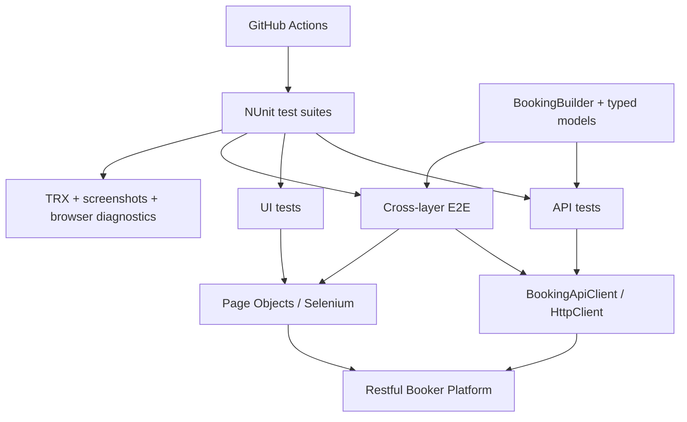

# Senior QA Automation Demo

A compact, interview-ready quality engineering portfolio built with **C#**, **.NET**,
**NUnit**, **HttpClient**, **Selenium 4**, and **GitHub Actions**. It validates the
public [Restful Booker Platform](https://automationintesting.online) across API and
browser layers and turns the same tests into visible CI quality gates.

This repository is intentionally small. Its purpose is to demonstrate test strategy,
maintainable automation, cross-layer validation, failure diagnostics, and delivery
judgement—not to maximise test count.

> All code, data, URLs, and terminology in this project are public or synthetic. No
> former-employer implementation or business information is used.

## What this demonstrates

- API CRUD, validation, negative, and contract-focused checks through a typed client.
- Dynamic, valid-by-default test data through a fluent booking builder.
- Selenium Page Objects with explicit waits and environment-driven browser setup.
- A flagship E2E journey: create through the API, verify persistence, then confirm the
  same guest booking in the admin UI.
- Actionable failure evidence: request/response context, TRX results, browser URL,
  screenshots, and browser logs where available.
- Fast PR smoke gates plus broader scheduled/manual regression and E2E execution.
- A risk-based explanation of what is automated, at which layer, and why.

## Architecture



Tests describe intent; API clients and Page Objects hide transport/browser mechanics;
builders own valid defaults; configuration stays outside test code.

## Test strategy at a glance

| Layer | Primary risk covered | Typical feedback | Pipeline use |
|---|---|---:|---|
| API | Business rules, persistence, HTTP contract | Seconds | PR smoke + regression |
| UI | Critical rendering, validation, authentication | Tens of seconds | PR smoke |
| E2E | API/UI integration and shared business state | Under a few minutes | Demo + scheduled/manual |

The API suite is intentionally broader than the browser suite. Browser checks are
reserved for risks that require a real UI, keeping the PR feedback loop fast and
failures easier to localise. See [the full strategy](docs/test-strategy.md).

## Quick start

Prerequisites:

- .NET SDK 9 (the repository pins a compatible SDK in `global.json`).
- Chrome or Firefox. Selenium Manager resolves the matching driver.
- Network access to the public training application.

```bash
dotnet restore
dotnet build --configuration Release
dotnet test --configuration Release
```

Run the interview-safe smoke selection:

```bash
./scripts/run-smoke.sh
```

Run the visible flagship E2E scenario (headed Chrome by default):

```bash
./scripts/run-demo.sh
```

The target is shared and may be reset by its maintainers. The framework creates
unique future-dated data, avoids parallel mutation, and attempts cleanup; it does not
send load or security traffic.

## Select suites directly

```bash
# Fast PR confidence
dotnet test --filter "TestCategory=Smoke"

# API only
dotnet test --filter "TestCategory=Api"

# Browser only
dotnet test --filter "TestCategory=Ui"

# Flagship integration journey
dotnet test --filter "TestCategory=E2E"

# Wider behavioural coverage
dotnet test --filter "TestCategory=Regression"
```

NUnit categories are deliberately orthogonal: a check can describe both its layer
(`Api`, `Ui`, `E2E`) and its delivery purpose (`Smoke`, `Regression`).

## Configuration

| Environment variable | Default | Purpose |
|---|---|---|
| `TEST_BASE_URL` | `https://automationintesting.online` | Hosted or local SUT root |
| `HEADLESS` | `true` | Headless browser execution |
| `BROWSER` | `chrome` | `chrome` or `firefox` |
| `UI_TIMEOUT_SECONDS` | `15` | Explicit wait ceiling |
| `ADMIN_USERNAME` | `admin` | Public training login; override elsewhere |
| `ADMIN_PASSWORD` | `password` | Public training login; override elsewhere |

Example:

```bash
HEADLESS=false BROWSER=chrome UI_TIMEOUT_SECONDS=20 ./scripts/run-demo.sh
```

## CI/CD quality gates

[`.github/workflows/qa-pipeline.yml`](.github/workflows/qa-pipeline.yml) separates
speed from breadth:

1. Every pull request restores and builds with warnings treated as errors.
2. API smoke tests run first and stop the browser stage if core services are unhealthy.
3. Headless UI smoke tests run only after the API gate passes.
4. Scheduled and manual runs provide regression/E2E breadth without slowing every PR.
5. Results and UI diagnostics are uploaded even when a test fails.

That sequencing answers two delivery questions: *how quickly can the team learn that a
change is unsafe?* and *how quickly can it understand why?*

## Repository map

```text
src/SeniorQaAutomation.Framework/
├── Api/             typed HTTP clients and response diagnostics
├── Configuration/   environment-backed settings
├── Models/          API contracts
├── PageObjects/     user-facing page services and locators
├── TestData/        valid-by-default builders
└── Ui/              browser factory, waits, screenshots

tests/SeniorQaAutomation.Tests/
├── Api/             smoke, CRUD, negative and contract scenarios
├── Ui/              focused browser scenarios
└── E2E/             API-created state verified through Selenium

docs/
├── interview-deck.md
├── demo-runbook.md
├── jacobs-question-bank.md
└── test-strategy.md
```

## Interview package

Use a **25–30 minute core presentation plus a controlled five-minute demo**, leaving
the rest of a one-hour interview for technical discussion:

- [Nine-slide deck with speaker notes](docs/interview-deck.md)
- [Ready-to-present PowerPoint](docs/Senior-QA-Automation-Interview.pptx)
- [Live demo runbook and fallback plan](docs/demo-runbook.md)
- [Senior QA question bank](docs/jacobs-question-bank.md)
- [Risk-based test strategy and role traceability](docs/test-strategy.md)

The demo is evidence for the engineering story, not the whole story. The strongest
discussion points are test-layer choice, deterministic setup, diagnostics, fast PR
feedback, collaboration, and how the approach would scale on a critical system.

## Deliberate limitations and next steps

- The hosted target is an external shared demo, so availability is not controlled by
  this repository. A team-owned pipeline would pin and start a known SUT build.
- These are system-level tests; meaningful unit coverage belongs in the application
  repository rather than being simulated here.
- The suite does not claim production-grade accessibility, performance, resilience,
  or security assurance. Those require agreed risks, environments, data, and tooling.
- At larger scale, add contract publication/consumer verification, containerised test
  environments, quarantine metrics, and trend reporting—without hiding flaky tests.

## Credits

The system under test is Mark Winteringham's open-source
[Restful Booker Platform](https://github.com/mwinteringham/restful-booker-platform),
created for practising testing and automation strategy. This repository is an
independent portfolio project and is not affiliated with Jacobs or the SUT maintainer.

## License

This portfolio framework is available under the [MIT License](LICENSE). The external
Restful Booker Platform has its own licence and remains the property of its authors.
